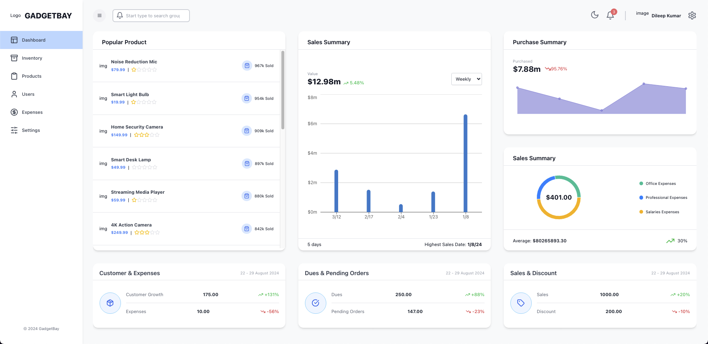
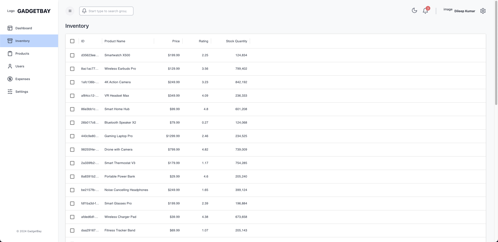
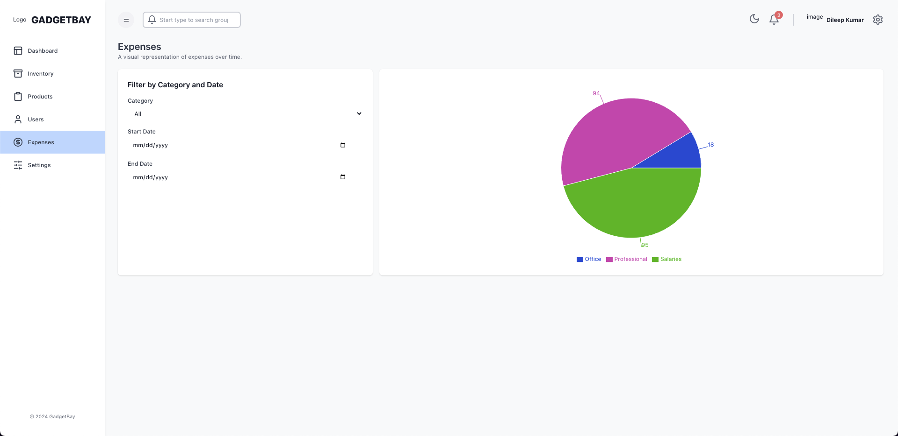
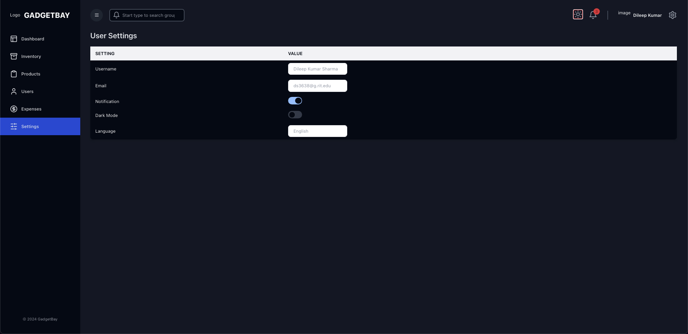

# GadgetBay - Electronic Gadgets Inventory

GadgetBay is a full-stack web application designed for managing an inventory of electronic gadgets. It provides users with an interface to monitor sales, purchases, expenses, and stock levels, alongside various analytics presented through charts and graphs. This project showcases advanced web technologies in both the frontend and backend, with cloud-based integration for enhanced scalability and performance.

## Table of Contents

- [Technology Stack](#technology-stack)
- [Project Overview](#project-overview)
- [Frontend Features](#frontend-features)
- [Backend Features](#backend-features)
- [Database Schema](#database-schema)
- [Images](#images)
- [Conclusion](#conclusion)

---

## Technology Stack

### Frontend

- **Next.js**: For server-side rendering, static site generation, and fast, SEO-friendly pages with smooth navigation.
- **Tailwind CSS**: Provides a highly customizable and responsive UI with minimal custom styling.
- **Material UI**: Specifically, the DataGrid component is used for table-based views, offering an interactive experience with sorting, filtering, and pagination.
- **Axios**: Used for making HTTP requests between the frontend and backend, handling API calls for real-time data synchronization.
- **Chart.js**: Used to visualize sales, purchases, and expense summaries in various forms such as bar charts, pie charts, and dot graphs.

### Backend

- **Node.js**: Backend runtime environment for processing requests and performing API operations.
- **Express.js**: Web framework for building RESTful APIs, handling routes and HTTP methods efficiently.
- **Prisma**: ORM used for interacting with PostgreSQL, providing easy-to-use database schemas and query building.
- **PostgreSQL**: Relational database system that stores data about gadgets, users, sales, purchases, and expenses.
- **Axios**: Handles API interactions between the backend and other services.

### Cloud Services

- **AWS EC2**: Hosts the backend server, ensuring a scalable and reliable infrastructure.
- **AWS S3**: Utilized for storing gadget images, providing secure file management and retrieval.
- **AWS RDS**: Manages the PostgreSQL database, ensuring high availability, scalability, and data integrity.

---

## Project Overview

GadgetBay offers a comprehensive dashboard for monitoring the status of an inventory system. The app's primary focus is to provide users with visual insights into sales, purchases, expenses, and stock levels, along with features like user management, product handling, and inventory monitoring.

The application is divided into two major components:

1. **Frontend**: Built using Next.js, Tailwind CSS, and Material UI. It provides a user-friendly, responsive UI with both light and dark modes.
2. **Backend**: Powered by Node.js, Express.js, and Prisma ORM to connect with a PostgreSQL database and handle business logic.

---

## Frontend Features

1. **Dashboard**:

   - Displays key metrics such as popular products, sales summary (bar graph), purchase summary (dot graph), and expenses (pie chart).
   - Overview of customer statistics, pending orders, sales, and discount details.

2. **Inventory**:

   - A table displaying the inventory with columns for product ID, product name, price, rating, and stock quantity.
   - Provides a clear and concise view of the current stock and product details.

3. **Products**:

   - Displays all available products in a card format, including images, names, stock quantity, rating, and price.

4. **Users**:

   - A table showing user data, including ID, name, and email, powered by **Material UI's DataGrid**, allowing for sorting, pagination, and filtering.

5. **Expenses**:

   - Displays expense details broken down into categories, visualized via pie charts.

6. **Settings**:

   - Users can toggle options such as dark mode and notifications.
   - Editable fields for username, email, and language preferences.

7. **Responsive Design**:
   - The application is fully responsive and supports both light and dark modes for better accessibility.
   - **Static Search Bar**: A static search design is present, with plans for future integration.

---

## Backend Features

1. **Node.js & Express.js**:

   - Built on a RESTful architecture, the backend exposes API endpoints for managing gadgets, users, sales, purchases, and expenses.

2. **Prisma ORM**:
   - Simplifies database interactions through its schema-driven approach.
   - Ensures easy handling of relational data between products, users, sales, purchases, and expenses.
3. **No Authentication**:
   - Currently, no user authentication or authorization is implemented. However, this is planned for future releases.

---

## Database Schema

The PostgreSQL database handles several tables, including:

- **Users**: Manages user information.
- **Products**: Stores product details, such as name, price, rating, and stock quantity.
- **Sales**: Tracks sales records, including product ID, timestamp, quantity, and total amount.
- **Purchases**: Logs purchase details, including product ID, timestamp, and total cost.
- **Expenses**: Logs expense details by category and amount.
- **Summaries**: Aggregates sales, purchases, and expense data for reporting purposes.

---

## Images

Here are some images from the GadgetBay application to showcase its functionality and UI:

|  |  |
| :-------------------------------------------: | :---------------------------------------------: |
|             _Dashboard Overview_              |             _Inventory Management_              |

|  |  |
| :--------------------------------: | :--------------------------------: |
|         _Product Listing_          |         _User Management_          |

---

## Conclusion

GadgetBay is a comprehensive full-stack project that demonstrates the integration of modern frontend and backend technologies. The application allows for efficient management of an electronic gadgets inventory, along with real-time data visualizations for sales, purchases, and expenses. With plans for future enhancements like authentication and a dynamic search feature, GadgetBay is set to evolve into a robust inventory management system.

---
